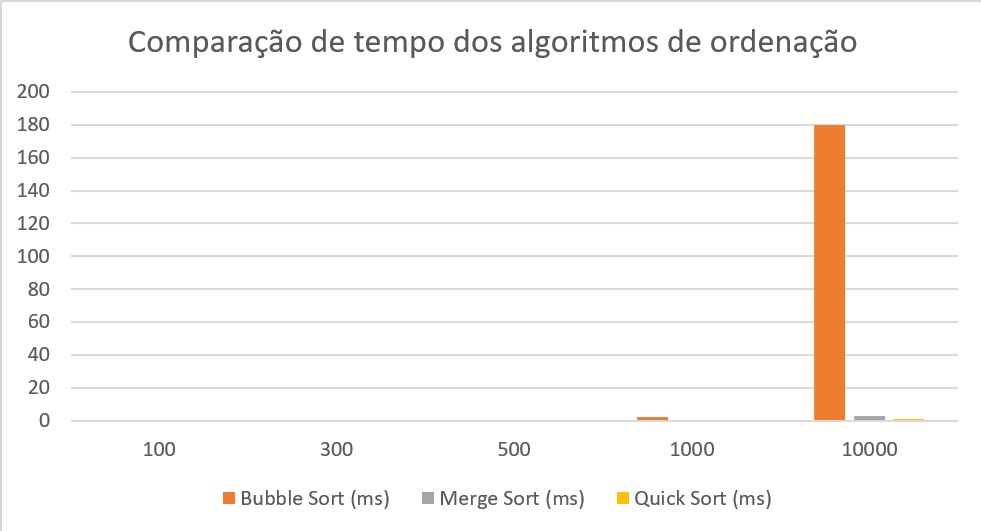

# 📊 Análise de Algoritmos – Algoritmos de Ordenação

Este projeto foi desenvolvido para a disciplina de **Análise de Algoritmos**, com o objetivo de comparar o tempo de execução dos algoritmos de ordenação **Bubble Sort**, **Merge Sort** e **Quick Sort**.

A atividade consiste em gerar vetores aleatórios de diferentes tamanhos, executar os três algoritmos sobre os mesmos dados de entrada e registrar os tempos obtidos em milissegundos.

## 📌 Sumário

- [Objetivo](#-objetivo)
- [Algoritmos analisados](#-algoritmos-analisados)
- [Tamanhos dos vetores](#-tamanhos-dos-vetores)
- [Estrutura do projeto](#-estrutura-do-projeto)
- [Descrição dos arquivos](#-descrição-dos-arquivos)
- [Relatório](#-relatório)
- [Compilação](#-compilação)
- [Execução](#-execução)
- [Resultados obtidos](#-resultados-obtidos)
- [Análise geral](#-análise-geral)
- [Ferramentas utilizadas](#-ferramentas-utilizadas)
- [Autoria](#-autoria)

## 🎯 Objetivo

Medir e comparar o desempenho dos algoritmos Bubble Sort, Merge Sort e Quick Sort em vetores com diferentes quantidades de elementos, observando a influência do tamanho da entrada no tempo de execução.

## 🧮 Algoritmos analisados

Os algoritmos utilizados foram:

* Bubble Sort
* Merge Sort
* Quick Sort

## 📏 Tamanhos dos vetores

Foram utilizados vetores aleatórios com os seguintes tamanhos:

* 100 elementos
* 300 elementos
* 500 elementos
* 1000 elementos
* 10000 elementos

## 🗂️ Estrutura do projeto

```text
ORDENADORES/
├── bin/
│   └── ordenadores.exe
├── img-graficos/
│   └── grafico-ordenadores.jpg
├── relatorio/
│   └── relatorio-ordenadores.pdf
├── resultados/
│   └── resultados.csv
├── src/
│   ├── algoritmos/
│   │   ├── bubble-sort.c
│   │   ├── merge-sort.c
│   │   └── quick-sort.c
│   ├── main.c
│   └── ordenadores.h
└── README.md
```

### Descrição dos arquivos

* `src/main.c`: arquivo principal do programa, responsável por gerar os vetores, copiar os dados, chamar os algoritmos, medir os tempos e gravar os resultados.
* `src/ordenadores.h`: arquivo de cabeçalho com os protótipos das funções utilizadas no projeto.
* `src/algoritmos/bubble-sort.c`: implementação do algoritmo Bubble Sort.
* `src/algoritmos/merge-sort.c`: implementação do algoritmo Merge Sort.
* `src/algoritmos/quick-sort.c`: implementação do algoritmo Quick Sort.
* `resultados/resultados.csv`: arquivo gerado com os tempos de execução dos algoritmos.
* `img-graficos/`: pasta com o gráfico comparativo.
* `relatorio/`: pasta com o relatório da atividade.

## 📄 Relatório

O relatório final da atividade está disponível no arquivo:

[Relatório final em PDF](relatorio/relatorio-ordenadores.pdf)

## ⚙️ Compilação

Para compilar o projeto, execute o comando abaixo na pasta raiz do projeto:

```bash
gcc src/main.c src/algoritmos/bubble-sort.c src/algoritmos/merge-sort.c src/algoritmos/quick-sort.c -o bin/ordenadores
```

## ▶️ Execução

Após compilar, execute:

```bash
.\bin\ordenadores.exe
```

O programa irá gerar o arquivo:

```text
resultados/resultados.csv
```

## 📊 Resultados obtidos

Os resultados obtidos na execução foram:

| Tamanho do vetor | Bubble Sort (ms) | Merge Sort (ms) | Quick Sort (ms) |
| ---------------: | ---------------: | --------------: | --------------: |
|              100 |                0 |               0 |               0 |
|              300 |                0 |               0 |               0 |
|              500 |                0 |               0 |               0 |
|             1000 |                2 |               0 |               0 |
|            10000 |              180 |               3 |               1 |

Os tempos iguais a 0 ms ocorreram porque a execução foi muito rápida para a precisão da função de medição utilizada.

## 📈 Análise geral

Os resultados mostram que o Bubble Sort apresentou maior crescimento no tempo de execução conforme o tamanho do vetor aumentou. Esse comportamento está relacionado à sua complexidade média **O(n²)**.

Já os algoritmos Merge Sort e Quick Sort apresentaram tempos menores para entradas maiores, pois possuem complexidade média **O(n log n)**, sendo mais eficientes para grandes volumes de dados.

### Gráfico comparativo

O gráfico abaixo apresenta a comparação entre os tempos de execução dos algoritmos:

<p align="center">
  
</p>

## 🛠️ Ferramentas utilizadas

* Linguagem C
* Visual Studio Code
* GCC
* Microsoft Excel ou ferramenta equivalente para geração do gráfico

## 👥 Autoria

Trabalho desenvolvido em grupo para a disciplina de **Análise de Algoritmos**.

Integrantes:

* Aline Oliveira de Pinho
* Breno Gonçalves Gomes
* Cariny Saldanha Oliveira
* Níchollas Pereira Holz
